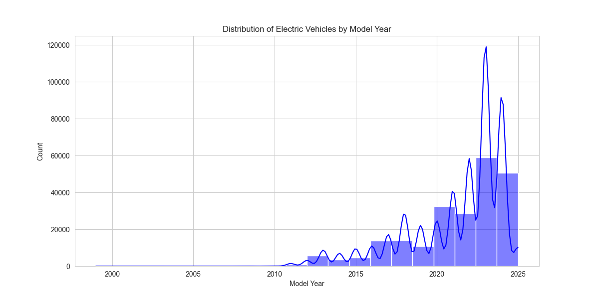
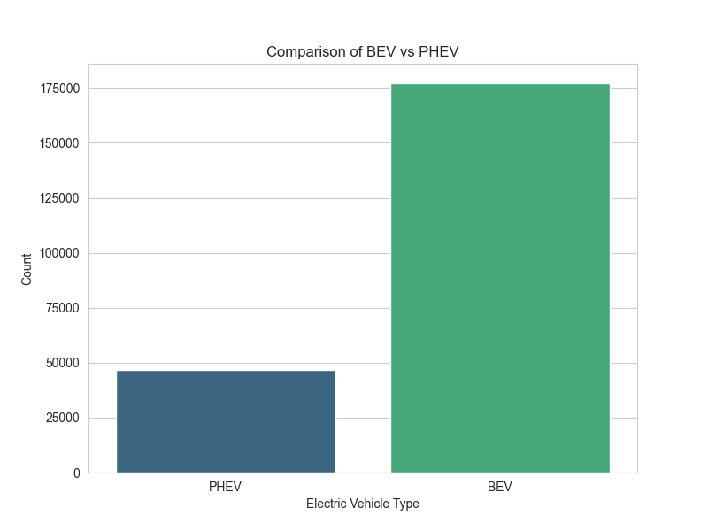
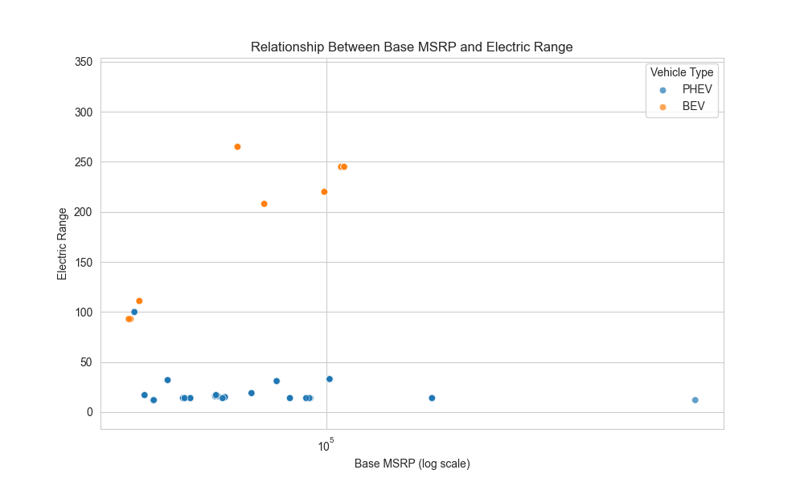
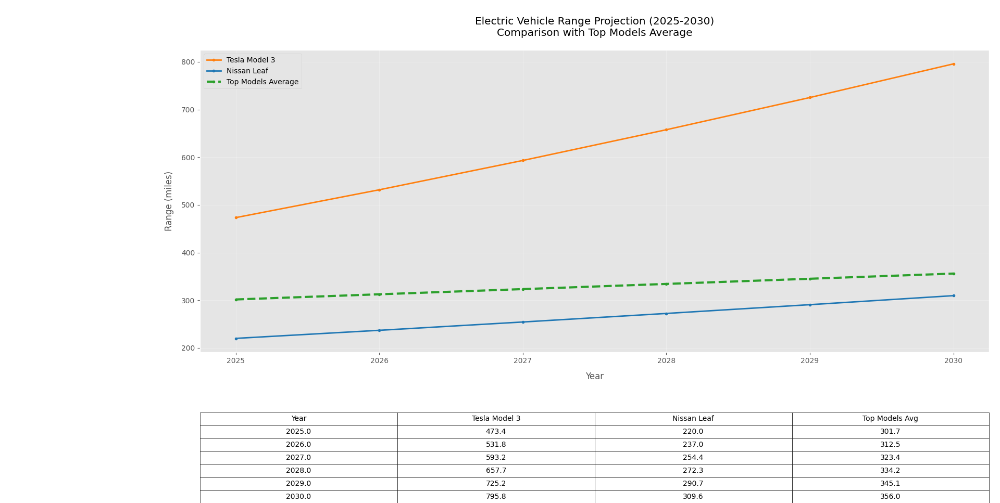

# Electric Vehicle Population Data Analysis

## Overview

This analysis explores the electric vehicle (EV) population in the United States using the 'Electric Vehicle Population Data' dataset. The dataset contains 223,995 records with information on vehicle make, model, type, model year, base MSRP, electric range, and geographical distribution. This data has been sourced from the data catalog of [data.gov](https://www.data.gov) and is available on Kaggle under the DOI citation: [10.34740/kaggle/dsv/4693417](https://doi.org/10.34740/kaggle/dsv/4693417).

## Key Analysis Areas
1. **Data Exploration**: Understanding the distribution of EVs by year, electric range, and vehicle type.
2. **Geographical Analysis**: Visualizing the distribution of EVs across the USA using a heatmap.
3. **Comparative Analysis**: Comparing Battery Electric Vehicles (BEVs) with Plug-in Hybrid Electric Vehicles (PHEVs) based on electric range and MSRP.
4. **Predictive Modeling**: Building a machine learning model to predict the electric range of top EV models for future years.

## Data Overview

The dataset contains 17 columns, including make, model, type, electric range, and MSRP. Minor missing data was found in the County, City, Postal Code, Electric Range, Base MSRP, and Legislative District columns. These were imputed where applicable.

## Key Findings

### 1. Distribution of Electric Vehicles by Model Year
The dataset contains EVs ranging from model year 1999 to 2025, with a significant increase in vehicles from 2018 onwards. Vehicles from 2020-2025 represent the majority of the dataset.



### 2. Comparison of BEV vs PHEV
Battery Electric Vehicles (BEVs) are the most common type of electric vehicle in the dataset, with 177,151 BEVs compared to 46,844 Plug-in Hybrid Electric Vehicles (PHEVs).



### 3. Relationship Between Base MSRP and Electric Range
Higher-priced vehicles generally offer a longer electric range, though there is significant variation within each price range.



### 4. Geographical Distribution of Electric Vehicles
A heatmap was generated to visualize the density of EV registrations across Washington State, showing that urban areas, particularly around Seattle, have the highest concentration of EVs.

[View Heatmap of EV Distribution](ev_distribution_map.html)

### 5. Top Electric Vehicle Manufacturers
Tesla leads the market with 96,180 vehicles, followed by Chevrolet (16,405) and Nissan (15,259).

---

## Electric Vehicle Range Projection (2025-2030)

### Methodology
- **Data Preparation**: The analysis focused on Battery Electric Vehicles (BEVs) with an electric range > 0 and models with at least 5 records.
- **Feature Engineering**: Created composite keys (Make_Model), calculated temporal features (Years_Since_2010), and identified top-performing models based on electric range.
- **Modeling**: A Gradient Boosting Regressor model was used to predict electric range, with the following features: Make & Model (OneHot encoded), Model Year (standardized), and a flag for top-performing models.

### Key Findings

#### 1. Model Accuracy
- **RMSE**: 57.29 miles
- **R²**: 0.44 (moderate predictive power)
  
The model shows general trends but room for improvement in predicting exact ranges.

#### 2. Range Projections (2025-2030)

| Year | Tesla Model 3 | Nissan Leaf | Top Models Avg | Tesla vs Avg | Nissan vs Avg |
|------|---------------|-------------|----------------|--------------|---------------|
| 2025 | 473.4         | 220.2       | 301.7          | +171.7       | -81.6         |
| 2026 | 531.8         | 226.6       | 312.6          | +219.2       | -75.6         |
| 2027 | 593.2         | 233.2       | 323.4          | +269.8       | -69.0         |
| 2028 | 657.7         | 240.0       | 334.2          | +323.5       | -61.9         |
| 2029 | 725.2         | 247.0       | 345.1          | +380.1       | -54.4         |
| 2030 | 795.8         | 254.3       | 356.0          | +439.8       | -46.3         |

#### 3. Competitive Landscape
- **Tesla**: Expected to maintain a 150-175 mile advantage over competitors.
- **Nissan**: Likely to fall 45-80 miles behind the industry average.
- **Market Polarization**: The gap between leading models and mainstream ones is expected to widen.

#### 4. Technology Trends
- **Annual Improvements**:
  - **Tesla**: ~4.0% range increase/year
  - **Industry Top Models**: ~3.5%/year
  - **Nissan**: ~2.0%/year
- **2030 Milestones**: Tesla could approach an 800-mile range, while industry averages may cross 350 miles.


---

## Technical Appendix

### Model Limitations
- **Data Constraints**: The dataset is limited to Washington State and does not include details on battery chemistry or technology.
- **Assumptions**: Linear improvement trends and current manufacturer R&D priorities were assumed to remain constant.

### Improvement Opportunities
- Incorporate battery capacity data and manufacturer R&D metrics for more accurate predictions.
- Expand the dataset to include global models.

---

## Business Implications

### For Consumers:
- **Tesla**: Likely to maintain its premium pricing due to its range superiority.
  
### For Competitors:
- Other manufacturers need to achieve a 25-30% faster range improvement to close the gap with Tesla.
  
### Infrastructure Planning:
- As EV ranges increase, the demand for charging stations may decrease, especially as the 800-mile range becomes more common.

---

1. **Clone this repository**:
   First, clone the repository to your local machine using the following command:
   ```bash
   git clone https://github.com/yourusername/electric-vehicle-analysis.git
   cd electric-vehicle-analysis
2. **Install dependencies**:
   Install all the required libraries by using the requirements.txt file:
   ```bash
   pip install -r requirements.txt

---
## Acknowledgements
Dataset Source: Kaggle - Electric Vehicle Population Data

Dataset Citation: DOI 10.34740/kaggle/dsv/4693417
   
  
   
   
